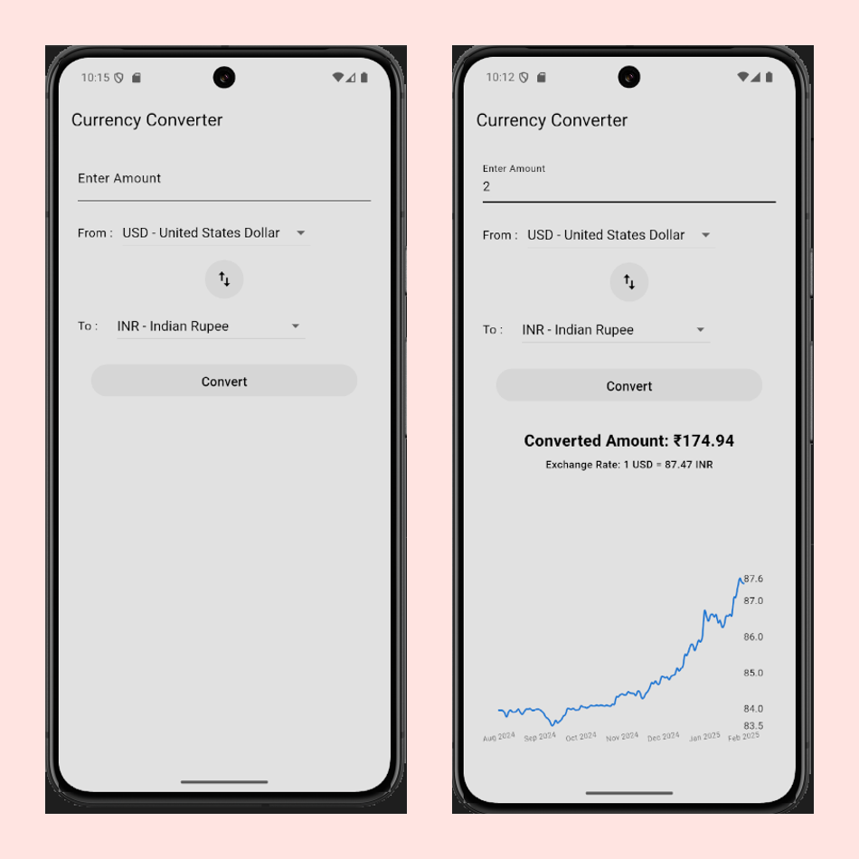
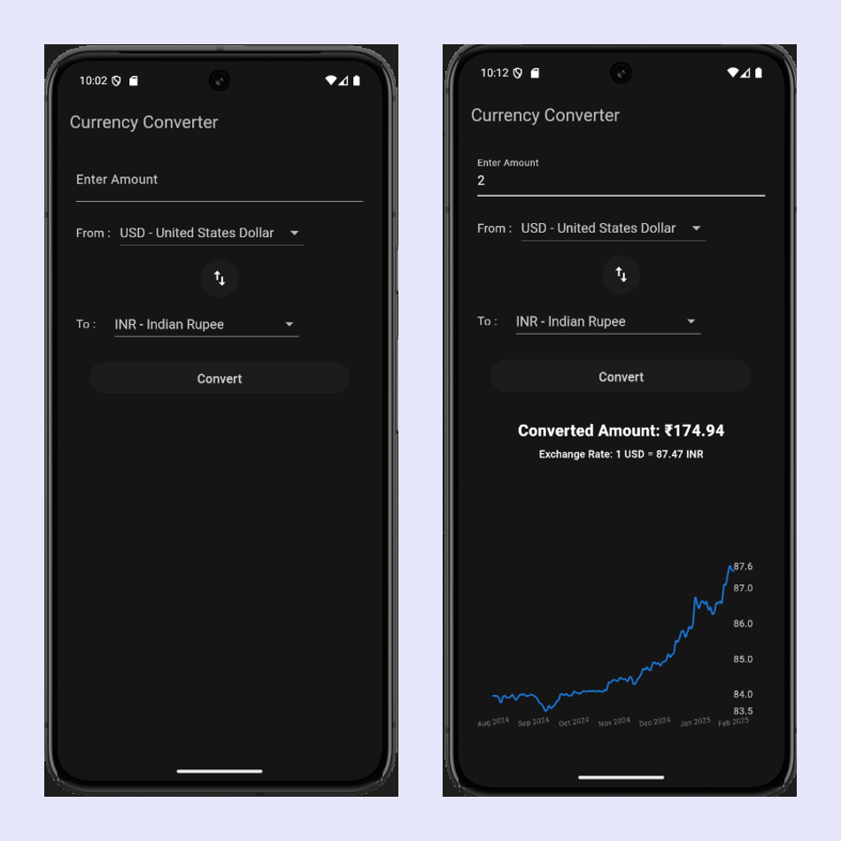

#   Currency Converter - Flutter App

A simple and efficient Currency Converter App built using Flutter. It allows users to convert between different currencies with real-time exchange rates and view historical trends through a graph.

## Features

- Convert currencies by selecting source and target currencies  
- Fetches real-time exchange rates from the Frankfurter API  
- Displays historical exchange rate trends using FlChart
- User-friendly minimal interface
- Supports dark mode for better readability  
- Allows users to swap source and destination currencies

## Tech Stack  

- Flutter  
- Dart - Programming language  
- Frankfurter API - Fetches exchange rates  

## Getting Started

Follow these steps to get the app up and running:

  1. Clone the repository: git clone https://github.com/shreyaax30/Currency-Converter.git
  2. Install dependencies: flutter pub get
  3. Run the app: flutter run

## API Integration

The app fetches exchange rates from the Frankfurter API. This API don't require API key.
